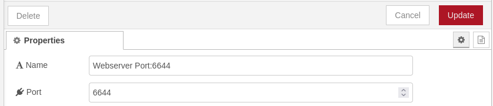
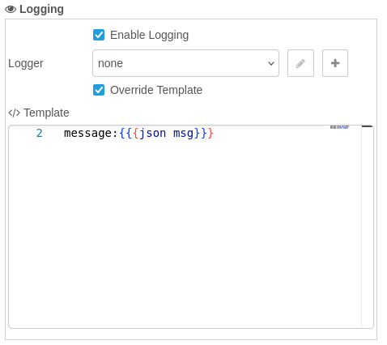
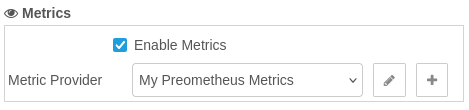
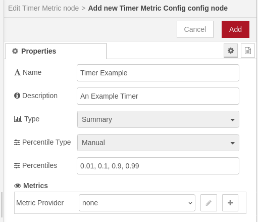
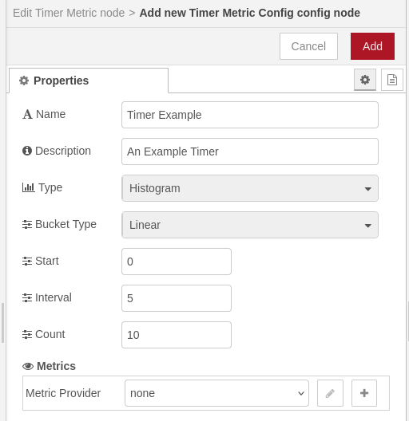
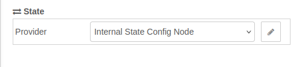
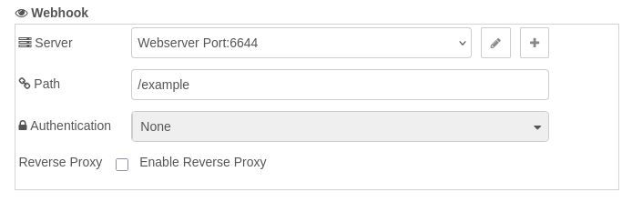

# @theotherwillembotha/node-red-plugincore

A TypeScript framework for building production-grade Node-RED plugins. Rather than scaffolding blank nodes from scratch, plugincore provides a collection of reusable helper components - base classes, decorator-driven injection, composable UI templates, and an assembly framework - that eliminate boilerplate and allow cross-plugin functionality like logging, metrics, and state management to be shared and reused without duplication.

This package serves two roles:

1. **Developer framework** - TypeScript base classes, decorators, and a build-time node generator that plugin authors extend to create their own Node-RED nodes. Cross-cutting concerns (logging, metrics, state, webhooks) are injected by annotation rather than manually wired.
2. **Shared runtime infrastructure** - a set of services and a Webhook Server config node that are installed into Node-RED and shared automatically across all plugins built on this framework.

Logger providers (Console, REST, Loki) and metrics providers (Prometheus) ship as separate optional plugins that plug into this infrastructure. See the [plugin ecosystem](#plugin-ecosystem) table at the end of this document.

---

## Usage in Node-RED

### Installation

Either use the **Manage Palette** option in the Node-RED editor, or run the following in your Node-RED user directory (typically `~/.node-red`):

```bash
npm install @theotherwillembotha/node-red-plugincore
```

This installs the shared infrastructure and the Webhook Server config node. To use logging or metrics in your flows, also install the relevant provider plugin (e.g. `node-red-logging`, `node-red-prometheus`).

### Config nodes

#### Webhook Server

The Webhook Server config node runs an Express v5 HTTP server on a configurable local port. It serves as the shared HTTP listener for any node that uses the `@Webhook` decorator or `WebhookTemplate`. Supports optional reverse proxy configuration so that registered webhook paths know their publicly-visible address.



*The Webhook Server config node. **Name** is a human-readable label shown in the Server dropdown of any node using `WebhookTemplate`. **Port** is the local TCP port the Express server listens on — each server instance must use a unique port. The **External Host** and **External Port** fields (not shown) are used when the server sits behind a reverse proxy, allowing registered webhook nodes to know their publicly-visible address.*

#### Logger providers

Logger config nodes are provided by separate plugins:

- **Console Logger**, **REST Logger** - [@theotherwillembotha/node-red-logging](https://github.com/theotherwillembotha/nodered_logging)
- **Loki Logger** - [@theotherwillembotha/node-red-loki](https://github.com/theotherwillembotha/nodered_loki)

Once a logger plugin is installed, a **Logging** section appears automatically in the editor of any node built with this framework. It is hidden when no logger plugins are present.

#### Metrics providers

Metrics config nodes are provided by separate plugins:

- **Prometheus** (Counter, Gauge, Histogram, `/metrics` endpoint) - [@theotherwillembotha/node-red-prometheus](https://github.com/theotherwillembotha/nodered_prometheus)

The **Metrics** section appears automatically in any node editor that supports metrics. It is hidden when no metrics plugins are installed.

---

## Development - Building plugins with this framework

### Prerequisites

- Node.js 18+
- Node-RED 4+
- TypeScript 5+

### Installation

```bash
npm install @theotherwillembotha/node-red-plugincore
```

### Required tsconfig.json

```json
{
  "compilerOptions": {
    "target":                  "es2022",
    "module":                  "commonjs",
    "rootDir":                 "./src",
    "outDir":                  "./build",
    "declaration":             true,
    "experimentalDecorators":  true,
    "emitDecoratorMetadata":   true,
    "useDefineForClassFields": false
  }
}
```

> **`useDefineForClassFields: false` is non-negotiable.** With `target: "es2022"`, TypeScript defaults this to `true`, which emits native class field initializers that run *after* `__decorate()`. This silently overwrites every `@Logger`, `@Metrics`, and other decorator-injected property with `undefined` at runtime - with no compile error and no startup warning.

> **`declaration: true`** is required if any downstream TypeScript package imports types from your plugin. Without it, consumers get `Could not find a declaration file for module '...'`.

---

## Building a flow node

A flow node is a node that appears on the Node-RED palette and processes messages passing through a flow. It extends `BaseNode`.

### Minimal example

The simplest possible flow node - no logging, no metrics, just message handling.

**`src/myplugin/node/EchoNode.ts`**

```typescript
import {
    BaseNode,         // base class for all flow nodes
    BaseNodeConfig,   // base interface for node config - all config interfaces extend this
    NodeDescription,  // decorator that registers the node type with the build system
    SourceUtility,    // resolves HTML file path correctly in both build and dev contexts
    onInput,          // decorator that wires a method to node.on("input")
    Message           // Node-RED message type
} from "@theotherwillembotha/node-red-plugincore";
import { Node } from "node-red";

// Extend BaseNodeConfig to declare this node's own configuration fields.
// Each field maps to a form input with id="node-input-<fieldName>".
interface EchoNodeConfig extends BaseNodeConfig {
    name:   string;
    prefix: string;
}

@NodeDescription({
    id:         "EchoNode",          // unique node type identifier across all plugins
    name:       "Echo",              // display name in the Node-RED editor
    group:      "my-plugin",         // palette group heading
    sourceFile: SourceUtility.getSourcePath("/build/", "/src/") + "EchoNode.html",
    package:    "@myscope/node-red-myplugin",  // must match the npm package name exactly
})
class EchoNode extends BaseNode<EchoNodeConfig> {

    constructor(node: Node, config: EchoNodeConfig) {
        super(node, config);
        // this.config is available here and throughout the class
    }

    // @onInput wires this method to node.on("input") automatically.
    // No need to call node.on("input", ...) in the constructor.
    @onInput()
    protected onMessageReceived(message: Message): void {
        (message as any).payload = `${this.config.prefix}: ${(message as any).payload}`;
        this.node().send(message as any);
    }
}

export { EchoNode };
```

**`src/myplugin/node/EchoNode.html`**

```html
<!-- onCompose runs at build time. "node" is a NodeBuilder instance.
     Register defaults and configure the palette appearance here.
     This section is NOT shipped to the browser. -->
<script type="text/javascript" template-section="onCompose">
    node.addDefault("name",   { value: "" });
    node.addDefault("prefix", { value: "Echo", required: true });
    node.setLabel(function() { return this.name || "Echo"; });
    node.setColor("#87CEEB");
    node.setIcon("font-awesome/fa-reply");
    node.setInput("in");
    node.addOutputs(["out"]);
</script>

<!-- onIncludeEditForm is the HTML rendered inside the editor dialog.
     Use id="node-input-<fieldName>" - Node-RED auto-saves and restores these. -->
<script type="text/html" template-section="onIncludeEditForm">
    <div class="form-row">
        <label for="node-input-name">Name</label>
        <input type="text" id="node-input-name" placeholder="Echo">
    </div>
    <div class="form-row">
        <label for="node-input-prefix">Prefix</label>
        <input type="text" id="node-input-prefix" placeholder="Echo">
    </div>
</script>

<!-- onIncludeDocumentation is rendered in the Node-RED sidebar Info panel. -->
<script type="text/markdown" template-section="onIncludeDocumentation">
## Echo

Prepends a configurable prefix to `msg.payload`.

### Properties

- **Name** - Display name in the editor.
- **Prefix** - Text prepended to the incoming payload.

### Output

The modified message is passed to the single output.
</script>
```

---

### Full-featured example

This version adds structured logging, a metrics counter, and a webhook route. Compare each addition to the minimal example above.

**`src/myplugin/node/WebhookListenerNode.ts`**

```typescript
import {
    BaseNode, BaseNodeConfig,
    NodeDescription, SourceUtility,
    LoggerTemplate, LoggerTemplateConfig,  // + adds the logging UI section and its config fields
    MetricsTemplate, MetricsTemplateConfig, // + adds the metrics UI section and its config fields
    WebhookTemplate,                        // + adds the webhook server selector and path field
    Log, Logger,                            // @Logger injects a Log instance at runtime
    CounterMetric, Metrics, MetricType,     // @Metrics injects a metric collector at runtime
    Webhook,                                // @Webhook registers HTTP routes with the webhook server
    onInput, Message
} from "@theotherwillembotha/node-red-plugincore";
import { Node } from "node-red";
import { Request, Response } from "express";

// Extend all three mixin config interfaces to include the fields
// that LoggerTemplate, MetricsTemplate, and WebhookTemplate manage.
interface WebhookListenerNodeConfig
    extends BaseNodeConfig, LoggerTemplateConfig, MetricsTemplateConfig {
    name:            string;
    webhookServer:   string;  // id of the WebhookServerConfigNode
    path:            string;  // HTTP path registered with the webhook server
}

@NodeDescription({
    id:         "WebhookListenerNode",
    name:       "Webhook Listener",
    group:      "my-plugin",
    sourceFile: SourceUtility.getSourcePath("/build/", "/src/") + "WebhookListenerNode.html",
    package:    "@myscope/node-red-myplugin",
    templates: [
        // Each template injects its own form rows, edit lifecycle hooks, and
        // onCompose defaults. Order here controls the order they appear in the editor.
        { template: LoggerTemplate,  config: {} },
        { template: MetricsTemplate, config: {} },
        { template: WebhookTemplate, config: {} },
    ]
})
class WebhookListenerNode extends BaseNode<WebhookListenerNodeConfig> {

    // Injected by the framework at runtime. Declare with ! - TypeScript cannot
    // see the injection mechanism at compile time.
    @Logger()
    private log!: Log;

    // Injected by the framework. The concrete implementation depends on which
    // metrics provider plugin is installed (e.g. Prometheus). Falls back to a
    // silent no-op if no provider is configured.
    @Metrics({ name: "webhook_requests_total", help: "Total inbound webhook requests", type: MetricType.Counter })
    private requestCount!: CounterMetric;

    // @Webhook registers the methods below with the WebhookServerConfigNode
    // referenced by this.config.webhookServer. Routes are registered on deploy
    // and removed on close.
    @Webhook()
    private webhook: any;

    constructor(node: Node, config: WebhookListenerNodeConfig) {
        super(node, config);
    }

    // HTTP route registered via @Webhook. Method name determines the HTTP verb.
    // The path is read from this.config.path at runtime.
    public post(req: Request, res: Response): void {
        this.requestCount.inc();
        this.log.log({ event: "webhook.received", body: req.body });
        this.node().send({ payload: req.body } as any);
        res.status(200).json({ ok: true });
    }

    @onInput()
    protected onMessageReceived(message: Message): void {
        // Example: forward messages onward unchanged
        this.node().send(message as any);
    }
}

export { WebhookListenerNode };
```

**`src/myplugin/node/WebhookListenerNode.html`**

The node's HTML file only contains its *own* fields. `LoggerTemplate`, `MetricsTemplate`, and `WebhookTemplate` inject their own form rows and edit lifecycle sections automatically - those sections are merged with this file's sections at build time.

```html
<script type="text/javascript" template-section="onCompose">
    // Only register this node's own fields. Logger, Metrics, and Webhook
    // fields are added automatically by their respective templates.
    node.addDefault("name",          { value: "" });
    node.addDefault("webhookServer", { value: "", required: true });
    node.addDefault("path",          { value: "/webhook" });
    node.setLabel(function() { return this.name || "Webhook Listener"; });
    node.setColor("#F0A500");
    node.setIcon("font-awesome/fa-sign-in");
    node.setInput("in");
    node.addOutputs(["out"]);
</script>

<!-- This section runs when the editor dialog opens (oneditprepare).
     Initialize any custom widgets here. Logger/Metrics/Webhook templates
     have their own onIncludeEditPrepare that runs alongside this one. -->
<script type="text/javascript" template-section="onIncludeEditPrepare">
    // Custom widget initialization goes here
</script>

<!-- The editor form. Logger, Metrics, and Webhook sections are appended
     automatically below these rows by their respective templates. -->
<script type="text/html" template-section="onIncludeEditForm">
    <div class="form-row">
        <label for="node-input-name">Name</label>
        <input type="text" id="node-input-name" placeholder="Webhook Listener">
    </div>
    <!-- Webhook server + path fields are injected by WebhookTemplate -->
</script>

<script type="text/markdown" template-section="onIncludeDocumentation">
## Webhook Listener

Registers an HTTP endpoint with a Webhook Server config node and emits a
message for each incoming request.

### Properties

- **Name** - Display name in the editor.
- **Logging** - Select a logger provider and optionally override the log template.
- **Metrics** - Select a metrics provider to track request counts.
- **Webhook Server** - The Webhook Server config node providing the HTTP listener.
- **Path** - The HTTP path to register (e.g. `/webhook`).

### Output

`msg.payload` contains the parsed request body.
</script>
```

> **Key differences from the minimal example:**
> - `templates` array in `@NodeDescription` - each entry auto-composes a UI section and its lifecycle hooks.
> - Config interface mixins (`LoggerTemplateConfig`, `MetricsTemplateConfig`) - provide TypeScript types for the fields those templates manage.
> - `@Logger()`, `@Metrics()`, `@Webhook()` on class properties - injected at runtime; always declare with `!`.
> - The node's HTML only handles its own fields; template-owned fields are never duplicated.

---

## Building a config node

A config node is a shared configuration resource referenced by multiple flow nodes. It extends `ConfigNode`. Config nodes do not appear on the palette; they are created from the editor's config node panel.

Config nodes follow the same pattern as flow nodes with two differences:
- Extend `ConfigNode<TConfig>` instead of `BaseNode<TConfig>`
- Form field IDs use `node-config-input-<fieldName>` instead of `node-input-<fieldName>`

```typescript
@NodeDescription({ id: "MyConfigNode", name: "My Config", group: "my-plugin", ... })
class MyConfigNode extends ConfigNode<MyConfigNodeConfig> {
    constructor(node: Node, config: MyConfigNodeConfig) {
        super(node, config);
        // register with a service, open a connection, etc.
    }
}
```

```html
<script type="text/html" template-section="onIncludeEditForm">
    <div class="form-row">
        <!-- config nodes use node-config-input-*, not node-input-* -->
        <label for="node-config-input-name">Name</label>
        <input type="text" id="node-config-input-name">
    </div>
</script>
```

---

## Cross-cutting infrastructure

These subsystems are the building blocks behind every shared UI section. Understanding how the pieces fit together makes it easier to build plugins that integrate cleanly with the rest of the ecosystem.

### Logger infrastructure

The logging subsystem has four parts:

| Part | Role |
|------|------|
| `LoggerService` | Background service that maintains logger instances. Must be registered in `GenerateNodes.ts`. |
| `@Logger()` | Property decorator. Injects a `Log` instance wired to whichever logger provider the user selected. |
| `LoggerTemplate` | UI template. Adds a **Logging** section to any node editor - an enable toggle, a logger provider selector, and an optional message template override. Hidden when no logger provider plugins are installed. |
| `LoggerConfigNode` | Abstract base class that logger provider plugins extend. Not registered in plugincore itself. |

**Using logging in a node:**

```typescript
// 1. Extend LoggerTemplateConfig in the node's config interface
interface MyNodeConfig extends BaseNodeConfig, LoggerTemplateConfig { ... }

// 2. Include LoggerTemplate in @NodeDescription templates
@NodeDescription({ ..., templates: [{ template: LoggerTemplate, config: {} }] })
class MyNode extends BaseNode<MyNodeConfig> {

    // 3. Declare the injected property
    @Logger()
    private log!: Log;

    @onInput()
    protected handle(msg: Message): void {
        this.log.log({ event: "received", payload: (msg as any).payload });
    }
}
```

**Creating a logger provider:**

Extend `LoggerConfigNode` and tag it so the `NodeTypeService` can discover it:

```typescript
import { LoggerConfigNode, ConfigNodeConfig, NodeDescription, SourceUtility }
    from "@theotherwillembotha/node-red-plugincore";

interface ConsoleLoggerConfig extends ConfigNodeConfig {
    name:     string;
    level:    string;
    template: string;
}

@NodeDescription({
    id:         "ConsoleLoggerConfigNode",
    name:       "Console Logger",
    group:      "logging",
    sourceFile: SourceUtility.getSourcePath("/build/", "/src/") + "ConsoleLoggerConfigNode.html",
    package:    "@myscope/node-red-logging",
    tags:       ["LoggerType"],   // <-- required: makes this discoverable as a logger provider
})
class ConsoleLoggerConfigNode extends LoggerConfigNode<ConsoleLoggerConfig> { ... }
```

The `"LoggerType"` tag is what causes this node to appear in the **Logger** dropdown of any node using `LoggerTemplate`.

**Screenshot - LoggerTemplate section** (as it appears inside a consumer node's editor):



*The Logging section injected by `LoggerTemplate`. The enable toggle controls whether log calls are forwarded to the provider. The Logger dropdown lists all installed logger providers, with edit (pencil) and create (plus) buttons. Override Template allows per-node customisation of the log format.*

---

### Metrics infrastructure

The metrics subsystem mirrors the logging subsystem exactly:

| Part | Role |
|------|------|
| `MetricsService` | Background service that maintains metric collector registrations. Must be registered in `GenerateNodes.ts`. |
| `@Metrics({...})` | Property decorator. Injects the appropriate metric type (Counter, Gauge, Histogram) from the configured provider. Falls back to a silent no-op when no provider is configured. |
| `MetricsTemplate` | UI template. Adds a **Metrics** section with a provider selector. Hidden when no metrics plugins are installed. |
| `MetricsConfigNode` | Abstract base class that metrics provider plugins extend. |

**Metric types:**

| `MetricType` | Property type | Description |
|--------------|--------------|-------------|
| `Counter` | `CounterMetric` | Monotonically increasing count. `.inc(amount?)` |
| `Gauge` | `GaugeMetric` | Value that can go up or down. `.set(value)`, `.inc()`, `.dec()` |
| `Histogram` | `HistogramMetric` | Distribution of observed values. `.observe(value)` |
| `Summary` | `SummaryMetric` | Quantile distribution. `.observe(value)` |

```typescript
@Metrics({ name: "messages_total",  help: "Messages processed",  type: MetricType.Counter   })
private messageCount!: CounterMetric;

@Metrics({ name: "queue_depth",     help: "Current queue depth", type: MetricType.Gauge     })
private queueDepth!: GaugeMetric;

@Metrics({ name: "process_seconds", help: "Processing latency",  type: MetricType.Histogram })
private latency!: HistogramMetric;
```

**Screenshot - MetricsTemplate section:**



*The Metrics section injected by `MetricsTemplate`. Enable Metrics controls whether metric calls are forwarded. The Metric Provider dropdown lists all installed metrics providers.*

**Metric config nodes** (provided by `node-red-prometheus`):

Plugin authors can create specialised metric config nodes to let users define named, reusable metric collectors that are referenced by flow nodes.


*Counter Metric Config Node - tracks a monotonically increasing count. **Name** and **Description** label the counter in the Prometheus `/metrics` output. **Reset on Deploy** zeroes the counter each time flows are re-deployed. **Metric Provider** selects the Prometheus instance to register with.*


*Gauge Metric Config Node - tracks a value that can increase or decrease freely. Configuration is identical to Counter, except the underlying metric type allows `.inc()`, `.dec()`, and `.set(value)` calls.*

Timer Metric Config Nodes can operate in two modes selected by the **Type** dropdown:



*Summary mode. **Percentile Type** controls whether percentile boundaries are computed automatically or specified manually. The **Percentiles** field accepts a comma-separated list of quantiles (e.g. `0.01, 0.1, 0.9, 0.99`).*



*Histogram mode. Observations are sorted into fixed buckets defined by **Bucket Type**, **Start**, **Interval**, and **Count**. Linear bucketing (shown) produces evenly spaced boundaries starting at Start and stepping by Interval.*

---

### State infrastructure

The state subsystem provides a common interface for externalising node state - allowing state to be stored and coordinated outside of Node-RED (e.g. in ZooKeeper). Nodes that need persistent or distributed state can use this subsystem without being coupled to a specific storage backend.

| Part | Role |
|------|------|
| `StateConfigNode` | Abstract base class. State provider plugins extend this. |
| `StateTemplate` | UI template. Adds a **State** section with a provider selector to any node editor. Auto-creates an `InternalStateConfigNode` on first open if no provider is configured. |

**Creating a state provider:**

Extend `StateConfigNode` and tag it `"StateProvider"`:

```typescript
@NodeDescription({ ..., tags: ["StateProvider"] })
class MyStateConfigNode extends StateConfigNode<MyStateConfig> { ... }
```

**Screenshot - StateTemplate section:**



*The State section injected by `StateTemplate`. The Provider dropdown lists all installed state provider nodes. The pencil button opens the selected provider's editor. If no external state provider is installed, an Internal State Config Node is created automatically and selected.*

---

### Webhook infrastructure

The webhook subsystem provides a shared Express v5 HTTP server that multiple nodes can register routes on.

| Part | Role |
|------|------|
| `WebhookServerConfigNode` | Config node (provided by plugincore itself). Runs the HTTP server on a configured port. |
| `@Webhook()` | Property decorator. Registers public methods (`get`, `post`, `put`, `delete`) as HTTP routes with the referenced `WebhookServerConfigNode`. |
| `WebhookTemplate` | UI template. Adds a webhook server selector and path field to the node editor. |



*The Webhook section injected by `WebhookTemplate`. **Server** is a dropdown that lists all `WebhookServerConfigNode` instances, with edit and add buttons. **Path** is the HTTP route registered on that server (e.g. `/example`). **Authentication** selects the credential strategy — None, Basic Auth, or API Key — and reveals the relevant credential fields when a strategy other than None is selected. **Reverse Proxy** is hidden unless a reverse proxy provider plugin (e.g. `node-red-nginxproxymanager`) is installed; when shown, it lets you map the webhook path to a public-facing domain.*

---

## NodeTypeService and DelegatedConfigReferenceNode

These two components are the plumbing behind the provider selector dropdowns. They are required in every plugin's `GenerateNodes.ts`.

### NodeTypeService

`NodeTypeService` exposes a `GET /nodetypeservice/find?tag=<tag>` endpoint that returns all registered node types carrying a given tag. This is how `LoggerTemplate`, `MetricsTemplate`, and `StateTemplate` discover available providers at runtime without any hardcoded knowledge of which plugins are installed.

When you annotate a node with `tags: ["LoggerType"]`, the `NodeTypeService` indexes it under that tag. Multiple tags are supported:

```typescript
@NodeDescription({
    id:   "PrometheusMetricsConfigNode",
    tags: ["MetricsProvider"],   // discoverable by MetricsTemplate
    ...
})
```

The selector templates query this endpoint in `onIncludeEditPrepare` and hide the entire section if the response is empty - so nodes that use `LoggerTemplate` or `MetricsTemplate` remain clean in setups where those provider plugins are not installed.

### DelegatedConfigReferenceNode

`DelegatedConfigReferenceNode` is a thin shim config node that acts as the property type for provider selector fields. It provides reference counting - Node-RED tracks how many nodes reference a given config node and prevents deletion while it is in use - without the normal behaviour where Node-RED resets a config selector to blank when the editor saves.

This is necessary because provider selectors (Logger, Metrics, State) are managed manually by the template's JavaScript rather than by Node-RED's auto-bind mechanism. Using `DelegatedConfigReferenceNode` as the declared type preserves reference counting while letting the template control the actual value.

`DelegatedConfigReferenceNode` must be registered in every plugin's `GenerateNodes.ts`:

```typescript
new NodeGenerator(...)
    .registerNode(DelegatedConfigReferenceNode)
    ...
```

---

## Node HTML file - template sections

Each node's `.html` file is divided into named sections using the `template-section` attribute. The build pipeline reads these sections and assembles them into the correct slots in the generated Node-RED registration call. Sections from multiple templates (`LoggerTemplate`, `MetricsTemplate`, etc.) are merged in the order they were registered.

```html
<script type="text/javascript" template-section="onCompose"> ... </script>
<div template-section="onIncludeOnce"> ... </div>
<script type="text/javascript" template-section="onIncludeEditPrepare"> ... </script>
<script type="text/html" template-section="onIncludeEditForm"> ... </script>
<script type="text/javascript" template-section="onIncludeEditSave"> ... </script>
<script type="text/javascript" template-section="onIncludeEditCancel"> ... </script>
<script type="text/javascript" template-section="onIncludeEditDelete"> ... </script>
<script type="text/markdown" template-section="onIncludeDocumentation"> ... </script>
```

### Section reference

| Section | When it runs | Typical use |
|---------|-------------|-------------|
| `onCompose` | At **build time** inside a `NodeBuilder` context | Call `node.addDefault(...)`, `node.setLabel(...)`, `node.setColor(...)`, `node.setIcon(...)`, `node.setInput(...)`, `node.addOutputs(...)`. Not shipped to the browser. |
| `onIncludeOnce` | Injected into the browser **once per page load** | Global styles (`<style>`), shared helper functions, and cached resource fetches. Wrap scripts in `<script>` inside a `<div>`. Shared across all instances. |
| `onIncludeEditPrepare` | Runs when the **node editor opens** (`oneditprepare`) | Initialise `typedInput` widgets, bind event handlers, fetch async data, restore saved state. Assign `this` to a variable before async code. |
| `onIncludeEditForm` | The **HTML form** inside the editor dialog | `<div class="form-row">` blocks. Use `id="node-input-<field>"` for flow nodes; `id="node-config-input-<field>"` for config nodes. |
| `onIncludeEditSave` | Runs when the user clicks **Done** (`oneditsave`) | Read widget values back into the node object. Standard `node-input-*` fields save automatically; use this only for non-standard fields. |
| `onIncludeEditCancel` | Runs when the user clicks **Cancel** (`oneditcancel`) | Clean up resources - always call `.dispose()` on `ScriptEditorTemplate` editors here to avoid Monaco memory leaks. |
| `onIncludeEditDelete` | Runs when the node is **deleted** | Release any persistent resources tied to this node instance. Rarely needed. |
| `onIncludeDocumentation` | Rendered in the **help panel** sidebar | Markdown describing the node's behaviour, properties, inputs, and outputs. |

### `onCompose` - NodeBuilder API

| Method | Description |
|--------|-------------|
| `node.addDefault(name, options)` | Register a config field. `options`: `{ value, required?, validate? }` |
| `node.setLabel(fn)` | Function returning the node's label at runtime (`this` = node instance) |
| `node.setPaletteLabel(label)` | Fixed palette label string |
| `node.setColor(color)` | Palette colour (hex string) |
| `node.setIcon(icon)` | Palette icon filename (relative to `icons/`, or `font-awesome/fa-*`) |
| `node.setLabelStyle(style)` | CSS class for the label (e.g. `node_label_white`) |
| `node.setInput(label)` | Add an input port |
| `node.addOutputs(labels)` | Add one or more output ports; pass a string array for labelled outputs |

---

## UI helpers

Including `UIHelperTemplate` in a node's `templates` array injects two client-side factory functions into the Node-RED editor page. Both are globally available as `PluginCore.dialog(...)` and `PluginCore.table(...)` and are styled to match Node-RED's editor aesthetic.

### `PluginCore.dialog(options)`

Opens a modal overlay with a title bar and one or more tabs.

```javascript
PluginCore.dialog({
    title: "My Plugin - Status",
    tabs: [
        {
            label: "Proxy Hosts",
            render: function($container) {
                $container.append(
                    PluginCore.table({
                        columns: [
                            { key: "id",   label: "ID" },
                            { key: "name", label: "Name" },
                            { key: "enabled", label: "Enabled",
                              render: function(v) {
                                  return $("<span>")
                                      .addClass(v ? "plugincore-status-enabled"
                                                  : "plugincore-status-disabled")
                                      .text(v ? "Enabled" : "Disabled");
                              }}
                        ],
                        rows: data
                    })
                );
            }
        }
    ]
});
```

| Option | Type | Description |
|--------|------|-------------|
| `title` | `string` | Heading in the dialog title bar |
| `tabs` | `array` | One or more tab definitions |
| `tabs[].label` | `string` | Tab heading |
| `tabs[].render` | `function($container)` | Called with a jQuery element - append content into it |

**Returns:** `{ close() }` - call `close()` to dismiss programmatically.

### `PluginCore.table(config)`

Returns a styled jQuery `<table>` ready to append into any container.

```javascript
var $table = PluginCore.table({
    columns: [
        { key: "id",     label: "ID" },
        { key: "domain", label: "Domain",
          render: function(value, row) { return value.join(", "); } }
    ],
    rows: arrayOfObjects
});
$container.append($table);
```

| Field | Type | Description |
|-------|------|-------------|
| `columns[].key` | `string` | Property name on each row object |
| `columns[].label` | `string` | Column header text |
| `columns[].render` | `function(value, row)` | Optional - return a string or jQuery element for custom cells |
| `rows` | `object[]` | Data rows |

**CSS classes for cell content:**

| Class | Colour | Use |
|-------|--------|-----|
| `plugincore-status-enabled` | Green | Active / enabled state |
| `plugincore-status-disabled` | Red | Inactive / disabled state |

### `PluginCore.createScriptEditor(elementId, template, initialValue)`

Including `ScriptEditorTemplate` in a node's `templates` array injects a Monaco-based script editor factory. Wraps the async Monaco initialisation into a single call.

```javascript
// In onIncludeEditPrepare:
let node = this;
node.scriptEditor = PluginCore.createScriptEditor(
    'node-input-script-editor',      // DOM id of the container element
    `async function(msg) { \${script} }`,  // TypeScript context template
    node.script || 'return true;'    // initial value
);

// In onIncludeEditSave:
node.script = node.scriptEditor.getValue();
delete node.scriptEditor;

// In onIncludeEditCancel - always call dispose() to avoid Monaco memory leaks:
node.scriptEditor.dispose();
delete node.scriptEditor;
```

**Returns:** `{ getValue(): string, dispose(): void }`

The `template` string provides TypeScript context that the Monaco language service uses for type checking and completions. Use `${script}` as the placeholder for the user's code - they see only their code, not the surrounding context.

---

> **Handlebars escaping in node HTML files**
>
> Node HTML files are processed by Handlebars during the build step. Any `{{ }}` anywhere in the file - including `<script>` blocks, comments, and markdown sections - will be interpreted as a Handlebars expression.
>
> Escape curly braces with a backslash wherever they appear literally:
>
> ```javascript
> // Wrong:  @returns {{ getValue(): string }}
> // Correct: @returns \{{ getValue(): string \}}
> ```

---

## Registering nodes for generation

Create a `GenerateNodes.ts` at the root of your `src/` directory. This is the composition root - register every service, template, and node, then call `.generate()` to emit the two Node-RED entry files.

```typescript
import { NodeGenerator } from "@theotherwillembotha/node-red-plugincore";
import {
    LoggerService, MetricsService, NodeTypeService, SettingsService,
    DelegatedConfigReferenceNode,
    BasicTemplate, LoggerTemplate, MetricsTemplate,
} from "@theotherwillembotha/node-red-plugincore";

import { MyService }    from "./myplugin/service/MyService";
import { MyConfigNode } from "./myplugin/node/MyConfigNode";
import { MyNode }       from "./myplugin/node/MyNode";

new NodeGenerator("./src/myplugin/")
    // ── Infrastructure ── required by every plugin; deduplication guards make this safe to register from multiple plugins
    .registerService(LoggerService)
    .registerService(MetricsService)
    .registerService(NodeTypeService)
    .registerService(SettingsService)
    .registerTemplate(BasicTemplate)
    .registerTemplate(LoggerTemplate)
    .registerTemplate(MetricsTemplate)
    .registerNode(DelegatedConfigReferenceNode)
    // ── Plugin-specific ──────────────────────────────────────────────────────
    .registerService(MyService)
    .registerNode(MyConfigNode)
    .registerNode(MyNode)
    .generate("./build/Nodes", "./build/Plugins");

process.exit(0);
```

Logger and metrics provider nodes (`ConsoleLoggerConfigNode`, `PrometheusMetricsConfigNode`, etc.) are **not** registered here. They are registered by their own dedicated plugins and discovered at runtime through the `NodeTypeService` tag system.

### Wiring up package.json

```json
{
  "node-red": {
    "version": ">=4.0.0",
    "nodes":   { "my-plugin": "./build/Nodes.js"   },
    "plugins": { "my-plugin": "./build/Plugins.js" }
  }
}
```

### Build

```bash
npm run build       # clean → tsc → generate node files → bundle (esbuild) → copy icons
npm run clean       # remove build/
```

---

## Plugin ecosystem

These plugins are built on this framework and available from npm. Each plugin is independently installable - only install what your flows need.

| Plugin | Uses from plugincore | Provides |
|--------|---------------------|----------|
| [@theotherwillembotha/node-red-logging](https://github.com/theotherwillembotha/nodered_logging) | `LoggerService` `LoggerConfigNode` | **Console Logger Config Node** (config) - writes log entries to stdout with configurable level and Handlebars message template<br>**REST Logger Config Node** (config) - POSTs structured log entries to an HTTP endpoint |
| [@theotherwillembotha/node-red-loki](https://github.com/theotherwillembotha/nodered_loki) | `LoggerService` `LoggerConfigNode` `LoggerTemplate` | **Loki Config Node** (config) - shared connection reference for a Grafana Loki backend<br>**Loki Logger Config Node** (config) - streams structured log entries to Loki<br>**Loki Query Node** (flow) - executes LogQL queries against a Loki backend and emits results |
| [@theotherwillembotha/node-red-telemetry](https://github.com/theotherwillembotha/nodered_telemetry) | `LoggerService` `LoggerTemplate` | **Logger Node** (flow) - attaches to any installed logger provider; routes `msg` through the selected logger on each message |
| [@theotherwillembotha/node-red-prometheus](https://github.com/theotherwillembotha/nodered_prometheus) | `MetricsService` `MetricsConfigNode` `WebhookTemplate` | **Prometheus Metrics Config Node** (config) - hosts a `/metrics` scrape endpoint via a Webhook Server<br>**Counter Metric Config Node** (config) - named monotonic counter<br>**Gauge Metric Config Node** (config) - named up/down value gauge<br>**Timer Metric Config Node** (config) - named latency timer (Histogram or Summary mode) |
| [@theotherwillembotha/node-red-zookeeper](https://github.com/theotherwillembotha/nodered_zookeeper) | `BaseNode` `ConfigNode` `LoggerTemplate` `StateConfigNode` | **ZooKeeper Server Config Node** (config) - shared ZooKeeper client connection<br>**ZooKeeper State Config Node** (config) - maps flow state names to ZooKeeper node values<br>**ZooKeeper Read Node** (flow) - reads a ZooKeeper node value on demand<br>**ZooKeeper Write Node** (flow) - writes a value to a ZooKeeper node<br>**ZooKeeper Subscribe Node** (flow) - emits a message each time a ZooKeeper node changes |
| [@theotherwillembotha/node-red-circuitbreaker](https://github.com/theotherwillembotha/nodered_circuitbreaker) | `BaseNode` `ConfigNode` `LoggerTemplate` `MetricsTemplate` `StateTemplate` `ScriptEditorTemplate` | **Circuit Breaker Config Node** (config) - manages open/closed/half-open state with configurable fault detection and trip logic<br>**Fault Detector Config Node** (config) - user-defined TypeScript function that evaluates messages for faults<br>**Circuit Breaker Node** (flow) - routes messages based on current breaker state and emits state-change events |
| [@theotherwillembotha/node-red-temporal](https://github.com/theotherwillembotha/nodered_temporal) | `BaseNode` `LoggerTemplate` | **Temporal Transform Node** (flow) - parses, adjusts, and formats date/time values across timezones using the TC39 Temporal API<br>**Temporal Duration Node** (flow) - computes the signed duration between two date/time values |
| [@theotherwillembotha/node-red-whatsapp](https://github.com/theotherwillembotha/nodered_whatsapp) | `BaseNode` `ConfigNode` `LoggerTemplate` `WebhookTemplate` | **WhatsApp Config Node** (config) - manages a Baileys WhatsApp session (no cloud API or subscription required)<br>**WhatsApp Send Node** (flow) - sends a WhatsApp message from a flow<br>**WhatsApp Receive Node** (flow) - emits a message for each incoming WhatsApp message |
| [@theotherwillembotha/node-red-nginxproxymanager](https://github.com/theotherwillembotha/nodered_nginxproxymanager) | `BaseNode` `ConfigNode` `LoggerTemplate` `UIHelperTemplate` | **Nginx Proxy Manager Config Node** (config) - shared connection to an Nginx Proxy Manager instance; registers as a reverse proxy provider for Webhook Server nodes<br>**Update Host Node** (flow) - creates or updates a proxy host entry<br>**Get Hosts Node** (flow) - retrieves the current list of proxy hosts, displayable via `PluginCore.dialog()` |

Additional plugins will be listed here as they are published.

---

## Repository

- Source: [github.com/theotherwillembotha/nodered_plugincore](https://github.com/theotherwillembotha/nodered_plugincore)
- Issues: [github.com/theotherwillembotha/nodered_plugincore/issues](https://github.com/theotherwillembotha/nodered_plugincore/issues)

## License

[ISC](LICENSE)
