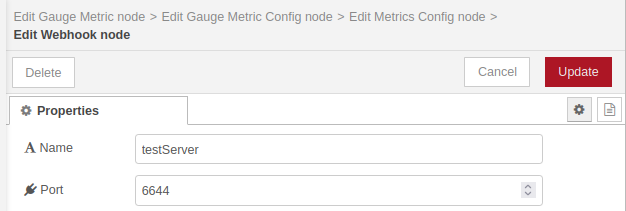

# @theotherwillembotha/node-red-plugincore

A TypeScript framework for building production-grade Node-RED plugins with built-in support for structured logging, Prometheus metrics, webhook servers, and reusable UI components.

This package has two roles:

1. **Developer framework** — a TypeScript base library that plugin authors extend to build their own Node-RED nodes, with decorators and templates that wire in logging, metrics, webhooks, and editor UI automatically.
2. **Shared infrastructure** — a set of abstract services and a Webhook Server config node that are installed into Node-RED and shared across all plugins built on this framework.

Logger providers (Console, REST, Loki) and metrics providers (Prometheus) ship as separate optional plugins. See the [plugin ecosystem](#plugin-ecosystem) table below.

---

## Plugin ecosystem

This framework is the foundation for a growing set of Node-RED plugins. The following plugins are currently available:

| Plugin | Description |
|--------|-------------|
| [@theotherwillembotha/node-red-logging](https://github.com/theotherwillembotha/nodered_logging) | Logger provider nodes — Console Logger and REST Logger config nodes that plug into the logging infrastructure provided by this package. |
| [@theotherwillembotha/node-red-loki](https://github.com/theotherwillembotha/nodered_loki) | Grafana Loki integration. Provides a Loki logger config node and a LogQL query node for reading log streams from Loki. |
| [@theotherwillembotha/node-red-telemetry](https://github.com/theotherwillembotha/nodered_telemetry) | Ready-to-use flow nodes for structured logging — a Logger node that attaches to any installed logger provider. |
| [@theotherwillembotha/node-red-prometheus](https://github.com/theotherwillembotha/nodered_prometheus) | Prometheus metrics provider. Provides a Prometheus config node with a `/metrics` scrape endpoint, and Counter, Gauge, and Histogram metric collectors. |
| [@theotherwillembotha/node-red-zookeeper](https://github.com/theotherwillembotha/nodered_zookeeper) | Apache ZooKeeper integration nodes. Subscribe to ZooKeeper node change events, read node values on demand, and write data to ZooKeeper nodes from your flows. |
| [@theotherwillembotha/node-red-circuitbreaker](https://github.com/theotherwillembotha/nodered_circuitbreaker) | Circuit Breaker nodes for building resilient flows. Detects faults in external integrations using configurable fault and trip functions, routes messages based on breaker state, and supports event-driven recovery flows. |
| [@theotherwillembotha/node-red-temporal](https://github.com/theotherwillembotha/nodered_temporal) | Date/time nodes powered by the TC39 Temporal API. Transform, adjust, and format date/time values across timezones, or compute the duration between two points in time — with multiple output modes, offset support, and a Moment.js-style custom format system. |
| [@theotherwillembotha/node-red-whatsapp](https://github.com/theotherwillembotha/nodered_whatsapp) | WhatsApp messaging nodes for Node-RED. Send and receive WhatsApp messages from your flows using the Baileys library — no cloud API or paid subscription required. |
| [@theotherwillembotha/node-red-nginxproxymanager](https://github.com/theotherwillembotha/nodered_nginxproxymanager) | Node-RED nodes for managing Nginx Proxy Manager hosts directly from your flows. Includes a config node that registers as a reverse proxy provider, an Update Host node for creating and updating proxy entries, and a Get Hosts node for retrieving the current host list. |
| [@theotherwillembotha/node-red-kafka](https://github.com/theotherwillembotha/nodered_kafka) | Apache Kafka producer and consumer nodes for Node-RED. Publish messages to Kafka topics and subscribe to incoming records directly from your flows. |

Additional plugins will be listed here as they are published.

---

## Usage in Node-RED

### Installation

Either use the **Manage Palette** option in the Node-RED editor, or run the following in your Node-RED user directory (typically `~/.node-red`):

```bash
npm install @theotherwillembotha/node-red-plugincore
```

This installs the shared infrastructure and the Webhook Server config node. To use logging or metrics in your flows, also install the relevant provider plugin (e.g. `node-red-logging`, `node-red-prometheus`).

### Config nodes

Config nodes are shared resources configured once and referenced across your flow.

#### Webhook Server

The Webhook Server config node runs an Express v5 HTTP server on a configurable local port. Supports optional reverse proxy configuration so that registered webhook paths know their publicly-visible address.



#### Logger providers

Logger config nodes are provided by separate plugins:

- **Console Logger**, **REST Logger** — [@theotherwillembotha/node-red-logging](https://github.com/theotherwillembotha/nodered_logging)
- **Loki Logger** — [@theotherwillembotha/node-red-loki](https://github.com/theotherwillembotha/nodered_loki)

The logger selector appears automatically in any node that includes `LoggerTemplate` — it is hidden when no logger plugins are installed, and populates with available providers when they are.

#### Metrics providers

Metrics config nodes are provided by separate plugins:

- **Prometheus** (Counter, Gauge, Histogram, `/metrics` endpoint) — [@theotherwillembotha/node-red-prometheus](https://github.com/theotherwillembotha/nodered_prometheus)

The metrics selector appears automatically in any node that includes `MetricsTemplate`, following the same conditional visibility pattern as the logger selector.

---

## Development — Building plugins with this framework

### Prerequisites

- Node.js 18+
- Node-RED 4+
- TypeScript 5+

### Installation

```bash
npm install @theotherwillembotha/node-red-plugincore
```

Your `tsconfig.json` must include the following options. **All are required — do not omit any.**

```json
{
  "compilerOptions": {
    "target":                  "es2022",
    "module":                  "commonjs",
    "rootDir":                 "./src",
    "outDir":                  "./build",
    "declaration":             true,
    "experimentalDecorators":  true,
    "emitDecoratorMetadata":   true,
    "useDefineForClassFields": false
  }
}
```

> **`useDefineForClassFields: false` is non-negotiable.** With `target: "es2022"`, TypeScript defaults this to `true`, which emits native class field initializers that run *after* `__decorate()`. This silently overwrites every `@Logger`, `@Metrics`, and other decorator-injected property with `undefined` at runtime — with no compile error and no startup warning.

### Defining a node

Extend `BaseNode` (or `ConfigNode` for config nodes) and annotate the class with `@NodeDescription`. The decorator registers the node type, its editor HTML file, the palette group it appears in, and any shared templates it composes in.

```typescript
import {
    BaseNode, BaseNodeConfig,
    NodeDescription, SourceUtility,
    LoggerTemplate, LoggerTemplateConfig,
    Log, Logger,
    onInput, Message
} from "@theotherwillembotha/node-red-plugincore";
import { Node } from "node-red";

interface MyNodeConfig extends BaseNodeConfig, LoggerTemplateConfig {
    name: string;
}

@NodeDescription({
    id: "MyNode",
    name: "My Node",
    group: "my-plugin",
    sourceFile: SourceUtility.getSourcePath("/build/", "/src/") + "MyNode.html",
    package: "@myscope/node-red-myplugin",
    templates: [
        { template: LoggerTemplate, config: {} }
    ]
})
class MyNode extends BaseNode<MyNodeConfig> {

    @Logger()
    private log!: Log;

    constructor(node: Node, config: MyNodeConfig) {
        super(node, config);
    }

    @onInput()
    protected onMessageReceived(message: Message): void {
        this.log.log({ received: message });
        this.node().send(message as any);
    }
}
```

The `LoggerTemplate` fragment is automatically composed into the node's editor panel, giving the user a logger selector and optional message template override with no additional HTML required. The section is hidden when no logger plugins are installed.

### Available decorators

| Decorator | Property type | What it injects |
|-----------|--------------|-----------------|
| `@Logger()` | `Log` | Winston logger wired to a user-selected logger provider config node |
| `@Metrics({...})` | `CounterMetric` / `GaugeMetric` / `HistogramMetric` | Abstract metrics collector — implementation supplied by the installed provider plugin |
| `@Webhook()` | — | Registers the node's routes with the webhook server |
| `@onInput()` | method | Wires the method as the Node-RED `input` message handler |

All `@Logger` and `@Metrics` properties must be declared with `!` (definite assignment assertion) — TypeScript cannot see the decorator injection mechanism at compile time.

### Templates

Templates bundle reusable UI fragments that compose into any node's editor panel. Include them in the `templates` array of `@NodeDescription`.

| Template | Adds to editor |
|----------|---------------|
| `LoggerTemplate` | Logger provider selector and optional message template override. Hidden when no logger plugins are installed. |
| `MetricsTemplate` | Metrics provider selector. Hidden when no metrics plugins are installed. |
| `WebhookTemplate` | Webhook server reference, path, auth, and reverse proxy config |
| `UIHelperTemplate` | Global `PluginCore.dialog()` and `PluginCore.table()` UI factories (see below) |
| `ScriptEditorTemplate` | Global `PluginCore.createScriptEditor()` factory for Monaco-based script editors (see below) |
| `BasicTemplate` | Base styles shared by all nodes |

### UI helpers

Including `UIHelperTemplate` in a node's `templates` list injects two client-side factory functions into the Node-RED editor page. Both are available globally as `PluginCore.dialog(...)` and `PluginCore.table(...)` and are styled to match Node-RED's own editor aesthetic.

#### `PluginCore.dialog(options)`

Opens a modal overlay with a title bar and one or more tabs. Closes on the close button, an overlay click, or Escape.

```javascript
PluginCore.dialog({
    title: "My Plugin — Status",
    tabs: [
        {
            label: "Proxy Hosts",
            render: function($container) {
                $container.append(
                    PluginCore.table({
                        columns: [
                            { key: "id",    label: "ID" },
                            { key: "name",  label: "Name" },
                            { key: "enabled", label: "Enabled",
                              render: function(v) {
                                  return $("<span>")
                                      .addClass(v ? "plugincore-status-enabled"
                                                  : "plugincore-status-disabled")
                                      .text(v ? "✔ Enabled" : "✘ Disabled");
                              }}
                        ],
                        rows: data
                    })
                );
            }
        }
    ]
});
```

**Options:**

| Field | Type | Description |
|-------|------|-------------|
| `title` | `string` | Heading shown in the dialog title bar |
| `tabs` | `array` | One or more tab definitions |
| `tabs[].label` | `string` | Tab heading |
| `tabs[].render` | `function($container)` | Called with a jQuery element; append content into it |

**Returns:** `{ close() }` — call `close()` to dismiss the dialog programmatically.

---

#### `PluginCore.table(config)`

Returns a styled jQuery `<table>` element ready to append into any container.

```javascript
var $table = PluginCore.table({
    columns: [
        { key: "id",     label: "ID" },
        { key: "domain", label: "Domain",
          render: function(value, row) { return value.join(", "); } }
    ],
    rows: arrayOfObjects
});
$container.append($table);
```

**Config:**

| Field | Type | Description |
|-------|------|-------------|
| `columns` | `array` | Column definitions |
| `columns[].key` | `string` | Property name on each row object |
| `columns[].label` | `string` | Column header text |
| `columns[].render` | `function(value, row)` | Optional. Return a string or jQuery element for custom cell rendering |
| `rows` | `object[]` | Data rows |

**CSS classes available for cell content:**

| Class | Colour | Intended use |
|-------|--------|-------------|
| `plugincore-status-enabled` | Green | Enabled / active state |
| `plugincore-status-disabled` | Red | Disabled / inactive state |

#### `PluginCore.createScriptEditor(elementId, template, initialValue)`

Including `ScriptEditorTemplate` in a node's `templates` list injects a Monaco-based script editor factory into the Node-RED editor page. It wraps the async Monaco initialisation boilerplate into a single call and returns a `{ getValue(), dispose() }` handle.

```javascript
// In onIncludeEditPrepare:
let scriptTemplate = `
    interface Message { [key: string]: any; }
    async function(msg: Message) {
    \${script}
    }
`;

node.scriptEditor = PluginCore.createScriptEditor(
    'node-input-script-editor',         // DOM id of the container element
    scriptTemplate,                      // TypeScript context template
    node.script || 'return true;'        // initial value
);

// In onIncludeEditSave:
node.script = node.scriptEditor.getValue();
delete node.scriptEditor;

// In onIncludeEditCancel:
node.scriptEditor.dispose();
delete node.scriptEditor;
```

The `template` string provides the TypeScript context that the Monaco language service uses for diagnostics, completions, and hover info. Use `\${script}` as the placeholder for the user's code. The user only sees their code — the surrounding context is invisible to them but informs type checking.

**Returns:** `{ getValue(): string, dispose(): void }`

> **Always call `dispose()` in `onIncludeEditCancel`.** Failing to do so leaks Monaco editor instances each time a user opens and cancels a node's editor.

---

> **Note — Handlebars escaping in node HTML files**
>
> Node HTML files (`.html` template files) are processed by Handlebars during the build. Any `{{ }}` syntax in the HTML — including in JavaScript comments, JSDoc, or markdown sections — will be interpreted as a Handlebars expression.
>
> Escape curly braces with a backslash wherever they appear literally:
>
> ```javascript
> // Wrong:
> // @returns {{ getValue(): string }}
>
> // Correct:
> // @returns \{{ getValue(): string \}}
> ```
>
> This applies everywhere in the file: `<script>` blocks, inline styles, markdown sections, and comments.

---

### Node HTML file — template sections

Each node's `.html` file is divided into named sections using the `template-section` attribute. The build pipeline reads these sections and assembles them into the correct slots in the generated Node-RED registration call. Sections from multiple templates (e.g. `LoggerTemplate`, `MetricsTemplate`) are merged automatically in the order they were registered.

```html
<script type="text/javascript" template-section="onCompose"> ... </script>
<div template-section="onIncludeOnce"> ... </div>
<script type="text/javascript" template-section="onIncludeEditPrepare"> ... </script>
<script type="text/html" template-section="onIncludeEditForm"> ... </script>
<script type="text/javascript" template-section="onIncludeEditSave"> ... </script>
<script type="text/javascript" template-section="onIncludeEditCancel"> ... </script>
<script type="text/javascript" template-section="onIncludeEditDelete"> ... </script>
<script type="text/markdown" template-section="onIncludeDocumentation"> ... </script>
```

#### Section reference

| Section | When it runs | Typical use |
|---------|-------------|-------------|
| `onCompose` | At **build time**, inside a `NodeBuilder` context | Call `node.addDefault(...)`, `node.setLabel(...)`, `node.setColor(...)`, `node.setIcon(...)`, `node.addOutputs(...)`, etc. to configure the node definition that will be written into the generated `Nodes.js`. This section is **not** shipped to the browser. |
| `onIncludeOnce` | Injected into the browser **once** per page load | Global styles (`<style>`), shared helper functions, and cached resource fetches. Everything here is shared across all node instances of this type. Wrap scripts in `<script>` tags inside a `<div>`. |
| `onIncludeEditPrepare` | Runs when the **node editor dialog opens** (`oneditprepare`) | Initialise `typedInput` widgets, bind event listeners, fetch async data, restore saved state. `this` refers to the node being edited — assign it to a local variable (e.g. `let node = this`) before any async code. |
| `onIncludeEditForm` | The **HTML form** rendered inside the editor dialog | `<div class="form-row">` blocks containing `<label>` and `<input>` elements. Use `id="node-input-<fieldName>"` for regular nodes or `id="node-config-input-<fieldName>"` for config nodes. |
| `onIncludeEditSave` | Runs when the user clicks **Done** (`oneditsave`) | Read widget values back into the node object before it is serialised. Most `node-input-*` fields save automatically; use this section for anything that does not. |
| `onIncludeEditCancel` | Runs when the user clicks **Cancel** (`oneditcancel`) | Clean up resources created in `onIncludeEditPrepare` — e.g. call `.dispose()` on Monaco editor instances. |
| `onIncludeEditDelete` | Runs when the node is **deleted** from the canvas | Release any persistent resources tied to this node instance. Rarely needed. |
| `onIncludeDocumentation` | Rendered in the Node-RED **help panel** (sidebar Info tab) | Markdown content describing the node's behaviour, fields, and examples. |

#### `onCompose` — NodeBuilder API

The `onCompose` script runs at build time with `node` bound to a `NodeBuilder` instance. The following methods are available:

| Method | Description |
|--------|-------------|
| `node.addDefault(name, options)` | Register a config field. `options`: `{ value, required, validate? }`. |
| `node.setLabel(fn)` | Set a function that returns the node's palette label at runtime. |
| `node.setPaletteLabel(label)` | Set the fixed palette label. |
| `node.setColor(color)` | Set the node's palette colour (hex string). |
| `node.setIcon(icon)` | Set the node's palette icon filename (relative to the plugin's `icons/` directory). |
| `node.setLabelStyle(style)` | Set the CSS class for the palette label (e.g. `node_label_white`). |
| `node.setInput(label)` | Add an input port with the given label. |
| `node.addOutputs(labels)` | Add one or more output ports. Pass a string array for multiple labelled outputs. |

#### Data flow through the edit lifecycle

```
oneditprepare  →  [user edits]  →  oneditsave   (Done clicked)
                                →  oneditcancel  (Cancel clicked)
                                →  oneditdelete  (node deleted)
```

Values flow through `node-input-<field>` (or `node-config-input-<field>`) named inputs. Node-RED automatically saves and restores these between sessions. Fields not following this convention must be manually read in `onIncludeEditSave` and written in `onIncludeEditPrepare`.

---

### Registering nodes for generation

Create a `GenerateNodes.ts` at the root of your `src/` directory. This is the composition root — register every service and node, then call `.generate()` to emit the two Node-RED entry files (`Nodes.js` and `Plugins.js`).

```typescript
import { NodeGenerator } from "@theotherwillembotha/node-red-plugincore";
import {
    LoggerService, MetricsService, NodeTypeService, SettingsService,
    DelegatedConfigReferenceNode,
} from "@theotherwillembotha/node-red-plugincore";

import { MyService }    from "./myplugin/service/MyService";
import { MyConfigNode } from "./myplugin/node/MyConfigNode";
import { MyNode }       from "./myplugin/node/MyNode";

new NodeGenerator("./src/myplugin/")
    // infrastructure (required by every plugin — deduplication guards make this safe)
    .registerService(LoggerService)
    .registerService(MetricsService)
    .registerService(NodeTypeService)
    .registerService(SettingsService)
    .registerNode(DelegatedConfigReferenceNode)
    // plugin-specific
    .registerService(MyService)
    .registerNode(MyConfigNode)
    .registerNode(MyNode)
    .generate("./build/Nodes", "./build/Plugins");

process.exit(0);
```

Logger and metrics provider nodes (`ConsoleLoggerConfigNode`, `PrometheusMetricsConfigNode`, etc.) are **not** registered here — they are registered by their own plugins and discovered at runtime via the `NodeTypeService` tag system.

### Wiring up package.json

```json
{
  "node-red": {
    "version": ">=4.0.0",
    "nodes":   { "my-plugin": "./build/Nodes.js"   },
    "plugins": { "my-plugin": "./build/Plugins.js" }
  }
}
```

### Build

```bash
npm run build       # clean → tsc → generate node files → bundle → copy icons
npm run clean       # remove build/
```

---

## Repository

- Source: [github.com/theotherwillembotha/nodered_plugincore](https://github.com/theotherwillembotha/nodered_plugincore)
- Issues: [github.com/theotherwillembotha/nodered_plugincore/issues](https://github.com/theotherwillembotha/nodered_plugincore/issues)

## License

[ISC](LICENSE)
