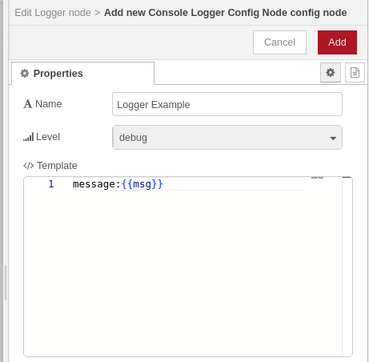
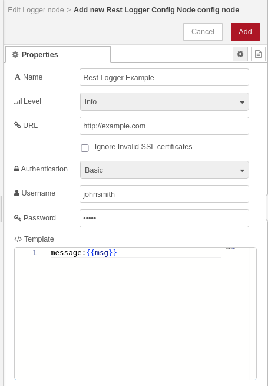
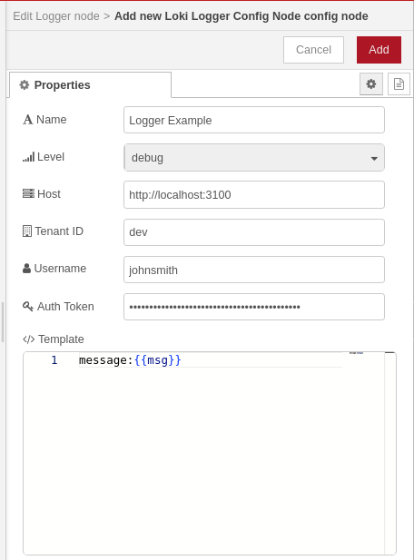
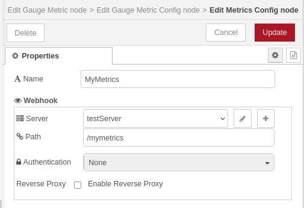
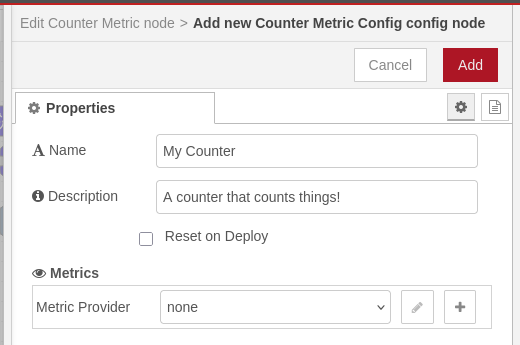
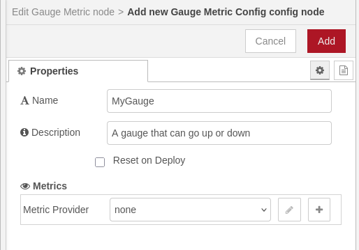
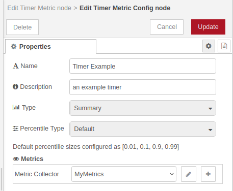

# @theotherwillembotha/node-red-plugincore

A TypeScript framework for building production-grade Node-RED plugins with built-in support for structured logging, Prometheus metrics, webhook servers, and reusable UI components.

This package has two roles:

1. **Config nodes** — a set of shared configuration nodes (loggers, metric collectors, webhook server) that are installed into Node-RED and referenced by other nodes in a flow.
2. **Developer framework** — a TypeScript base library that plugin authors extend to build their own Node-RED nodes, with decorators and templates that wire in logging, metrics, webhooks, and editor UI automatically.

---

## Plugin ecosystem

This framework is the foundation for a growing set of Node-RED plugins. The following plugins are currently available:

| Plugin | Description |
|--------|-------------|
| [@theotherwillembotha/node-red-telemetry](https://github.com/theotherwillembotha/nodered_telemetry) | Ready-to-use flow nodes for structured logging and Prometheus metrics — Logger, Counter, Gauge, and Timer nodes that attach to the config nodes provided by this package. |
| [@theotherwillembotha/node-red-nginxproxymanager](https://github.com/theotherwillembotha/nodered_nginxproxymanager) | Node-RED nodes for managing Nginx Proxy Manager hosts directly from your flows. Includes a config node that registers as a reverse proxy provider, an Update Host node for creating and updating proxy entries, and a Get Hosts node for retrieving the current host list. |

Additional plugins will be listed here as they are published.

---

## Usage in Node-RED

### Installation

Either use the **Manage Palette** option in the Node-RED editor, or run the following in your Node-RED user directory (typically `~/.node-red`):

```bash
npm install @theotherwillembotha/node-red-plugincore
```

This installs the config nodes below and makes them available in your palette. Typically you would also install a plugin such as [node-red-telemetry](https://github.com/theotherwillembotha/nodered_telemetry) to get the actual flow nodes that reference them.

### Config nodes

Config nodes are shared resources configured once and referenced across your flow. They appear under their own groups in the palette sidebar.

#### Logging

Three logger backends are supported. All expose the same interface and are interchangeable — any node built with the `@Logger` decorator can use any of them.

**Console Logger** — writes structured log output to stdout via Winston. Ideal for development and containerised deployments that forward stdout to a log aggregator.



**REST Logger** — ships log entries to a remote HTTP/HTTPS endpoint. Supports Basic and API Key authentication.



**Loki Logger** — pushes log entries to a Grafana Loki instance via the Loki HTTP API. Supports multi-tenant deployments via the Tenant ID field.



All three loggers share a **Level** selector (debug, info, warn, error) and a **Template** field — a Handlebars template that controls the shape of each log entry. The default `message:{{msg}}` passes the raw message through; you can customise it to include only the fields you care about.

#### Metrics

Prometheus-compatible metric collectors. A scrape endpoint (`/metrics`) is provided automatically once any metric node is deployed.

| Node | Description |
|------|-------------|
| **Metrics Config** | Top-level Prometheus registry. One per deployment. |
| **Counter Metric** | An ever-increasing counter (e.g. messages processed, errors). |
| **Gauge Metric** | A value that goes up and down (e.g. queue depth, active connections). |
| **Timer Metric** | A histogram or summary for measuring durations (e.g. processing time per message). |



**Counter** and **Gauge** share the same layout — a name, a description, and an optional reset-on-deploy toggle:




The **Timer** config adds a metric type selector (Histogram or Summary) with configurable bucket or percentile strategies:



#### Webhook Server

| Node | Description |
|------|-------------|
| **Webhook Server** | Runs an Express v5 HTTP server on a configurable local port. Supports optional reverse proxy configuration so that registered webhook paths know their publicly-visible address. |


---

## Development — Building plugins with this framework

### Prerequisites

- Node.js 18+
- Node-RED 4+
- TypeScript 5+ with `experimentalDecorators` and `emitDecoratorMetadata` enabled

### Installation

```bash
npm install @theotherwillembotha/node-red-plugincore
```

Your `tsconfig.json` must include:

```json
{
  "compilerOptions": {
    "experimentalDecorators": true,
    "emitDecoratorMetadata": true
  }
}
```

### Defining a node

Extend `BaseNode` (or `ConfigNode` for config nodes) and annotate the class with `@NodeDescription`. The decorator registers the node type, its editor HTML file, the palette group it appears in, and any shared templates it composes in.

```typescript
import {
    BaseNode, BaseNodeConfig,
    NodeDescription, SourceUtility,
    LoggerTemplate, LoggerTemplateConfig,
    Log, Logger
} from "@theotherwillembotha/node-red-plugincore";
import { Node } from "node-red";

interface MyNodeConfig extends BaseNodeConfig, LoggerTemplateConfig {
    name: string;
}

@NodeDescription({
    id: "my-node",
    name: "My Node",
    group: "my-plugin",
    sourceFile: SourceUtility.getSourcePath("/build/", "/src/") + "MyNode.html",
    package: "@myscope/my-nodered-plugin",
    templates: [
        { template: LoggerTemplate, config: {} }
    ]
})
class MyNode extends BaseNode<MyNodeConfig> {

    @Logger()
    private log!: Log;

    constructor(node: Node, config: MyNodeConfig) {
        super(node, config);
    }

    protected onInit() {
        this.log.log("MyNode initialised");
    }
}
```

The `LoggerTemplate` fragment is automatically composed into the node's editor panel, giving the user a logger selector and optional message template override with no additional HTML required.

### Available decorators

| Decorator | Property type | What it injects |
|-----------|--------------|-----------------|
| `@Logger()` | `Log` | Winston logger wired to a user-selected logger config node |
| `@Metrics({...})` | `CounterMetric` / `GaugeMetric` / `HistogramMetric` | Prometheus metric collector |
| `@Webhook()` | — | Registers the node's routes with the webhook server |
| `@onInput()` | method | Wires the method as the Node-RED `input` message handler |

### Templates

Templates bundle reusable UI fragments that compose into any node's editor panel. Include them in the `templates` array of `@NodeDescription`.

| Template | Adds to editor |
|----------|---------------|
| `LoggerTemplate` | Logger backend selector and optional message template override |
| `MetricsTemplate` | Metrics enable toggle and collector reference |
| `CounterMetricTemplate` | Counter config node reference |
| `GaugeMetricTemplate` | Gauge config node reference |
| `TimerMetricTemplate` | Timer config node reference |
| `WebhookTemplate` | Webhook server reference, path, auth, and reverse proxy config |
| `UIHelperTemplate` | Global `PluginCore.dialog()` and `PluginCore.table()` UI factories (see below) |
| `ScriptEditorTemplate` | Global `PluginCore.createScriptEditor()` factory for Monaco-based script editors (see below) |
| `SettingsTemplate` | General settings section |
| `BasicTemplate` | Base styles shared by all nodes |

### UI helpers

Including `UIHelperTemplate` in a node's `templates` list injects two client-side factory functions into the Node-RED editor page. Both are available globally as `PluginCore.dialog(...)` and `PluginCore.table(...)` and are styled to match Node-RED's own editor aesthetic.

#### `PluginCore.dialog(options)`

Opens a modal overlay with a title bar and one or more tabs. Closes on the close button, an overlay click, or Escape.

```javascript
PluginCore.dialog({
    title: "My Plugin — Status",
    tabs: [
        {
            label: "Proxy Hosts",
            render: function($container) {
                $container.append(
                    PluginCore.table({
                        columns: [
                            { key: "id",    label: "ID" },
                            { key: "name",  label: "Name" },
                            { key: "enabled", label: "Enabled",
                              render: function(v) {
                                  return $("<span>")
                                      .addClass(v ? "plugincore-status-enabled"
                                                  : "plugincore-status-disabled")
                                      .text(v ? "✔ Enabled" : "✘ Disabled");
                              }}
                        ],
                        rows: data
                    })
                );
            }
        }
    ]
});
```

**Options:**

| Field | Type | Description |
|-------|------|-------------|
| `title` | `string` | Heading shown in the dialog title bar |
| `tabs` | `array` | One or more tab definitions |
| `tabs[].label` | `string` | Tab heading |
| `tabs[].render` | `function($container)` | Called with a jQuery element; append content into it |

**Returns:** `{ close() }` — call `close()` to dismiss the dialog programmatically.

---

#### `PluginCore.table(config)`

Returns a styled jQuery `<table>` element ready to append into any container.

```javascript
var $table = PluginCore.table({
    columns: [
        { key: "id",     label: "ID" },
        { key: "domain", label: "Domain",
          render: function(value, row) { return value.join(", "); } }
    ],
    rows: arrayOfObjects
});
$container.append($table);
```

**Config:**

| Field | Type | Description |
|-------|------|-------------|
| `columns` | `array` | Column definitions |
| `columns[].key` | `string` | Property name on each row object |
| `columns[].label` | `string` | Column header text |
| `columns[].render` | `function(value, row)` | Optional. Return a string or jQuery element for custom cell rendering |
| `rows` | `object[]` | Data rows |

**CSS classes available for cell content:**

| Class | Colour | Intended use |
|-------|--------|-------------|
| `plugincore-status-enabled` | Green | Enabled / active state |
| `plugincore-status-disabled` | Red | Disabled / inactive state |

#### `PluginCore.createScriptEditor(elementId, template, initialValue)`

Including `ScriptEditorTemplate` in a node's `templates` list injects a Monaco-based script editor factory into the Node-RED editor page. It wraps the async Monaco initialisation boilerplate into a single call and returns a `{ getValue(), dispose() }` handle.

```javascript
// In onIncludeEditPrepare:
let scriptTemplate = `
    interface Message { [key: string]: any; }
    async function(msg: Message) {
    \${script}
    }
`;

node.scriptEditor = PluginCore.createScriptEditor(
    'node-input-script-editor',         // DOM id of the container element
    scriptTemplate,                      // TypeScript context template
    node.script || 'return true;'        // initial value
);

// In onIncludeEditSave:
node.script = node.scriptEditor.getValue();
delete node.scriptEditor;

// In IncludeEditCancel:
node.scriptEditor.dispose();
delete node.scriptEditor;
```

The `template` string provides the TypeScript context that the Monaco language service uses for diagnostics, completions, and hover info. Use `\${script}` as the placeholder for the user's code. The user only sees their code — the surrounding context is invisible to them but informs type checking.

**Returns:** `{ getValue(): string, dispose(): void }`

---

> **Note — Handlebars escaping in node HTML files**
>
> Node HTML files (`.html` template files) are processed by Handlebars during the build. This means any `{{ }}` syntax in the HTML — including in JavaScript comments or JSDoc — will be interpreted as a Handlebars expression and produce unexpected output or an error.
>
> Escape curly braces with a backslash wherever they appear literally in the file:
>
> ```javascript
> // Wrong — Handlebars will try to evaluate this:
> // @returns {{ getValue(): string }}
>
> // Correct — escaped so Handlebars passes it through:
> // @returns \{{ getValue(): string \}}
> ```
>
> This applies anywhere in the HTML file: `<script>` blocks, inline styles, markdown documentation sections, and comments.

---

### Registering nodes for generation

Create a `GenerateNodes.ts` at the root of your `src/` directory. This is the composition root — register every service, template, and node, then call `.generate()` to emit the two Node-RED entry files (`Nodes.js` and `Plugins.js`).

```typescript
import { NodeGenerator } from "@theotherwillembotha/node-red-plugincore";
import {
    LoggerService, LoggerTemplate,
    ConsoleLoggerConfigNode, RestLoggerConfigNode, LokiLoggerConfigNode
} from "@theotherwillembotha/node-red-plugincore";
import { MyNode } from "./nodes/MyNode";

new NodeGenerator("./src/")
    .registerService(LoggerService)
    .registerTemplate(LoggerTemplate)
    .registerNode(ConsoleLoggerConfigNode)
    .registerNode(RestLoggerConfigNode)
    .registerNode(LokiLoggerConfigNode)
    .registerNode(MyNode)
    .generate("./build/Nodes", "./build/Plugins");

process.exit(0);
```

Only register the services and config nodes your plugin actually depends on. You do not need to re-register nodes from this package if your plugin does not expose them directly.

### Wiring up package.json

```json
{
  "node-red": {
    "version": ">=4.0.0",
    "nodes":   { "my-plugin": "./build/Nodes.js"   },
    "plugins": { "my-plugin": "./build/Plugins.js" }
  }
}
```

### Build

```bash
npm run build       # clean → tsc → generate node files → copy icons
npm run clean       # remove build/
```

---

## Repository

- Source: [github.com/theotherwillembotha/nodered_plugincore](https://github.com/theotherwillembotha/nodered_plugincore)
- Issues: [github.com/theotherwillembotha/nodered_plugincore/issues](https://github.com/theotherwillembotha/nodered_plugincore/issues)

## License

[ISC](LICENSE)
